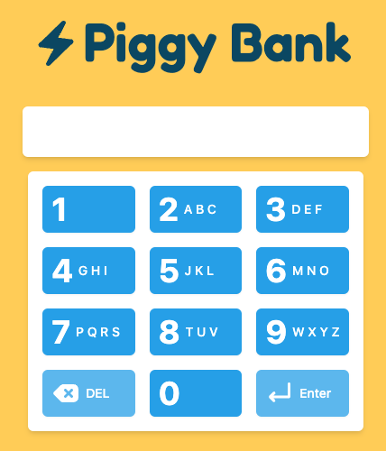
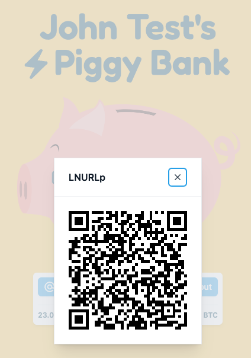

# Piggy Bank

[](https://github.com/thespielplatz/piggy-bank/)
[](https://github.com/thespielplatz/piggy-bank/blob/main/LICENSE)
[](https://github.com/thespielplatz/piggy-bank/stargazers)

A small piggy bank for pre-coiners, managed by their custodian.

| **Homepage** | **Piggy Bank** | **Payment** |
|---|---|---|
|  |  |  |

## Features

- **View Satoshis Balance**: Displays the amount of sats in an LNBits account, accessible via a PIN code.
- **LNURLp Integration**: Displays the first LNURL-pay link from the LNBits API, if available.
- **LN Address Display**: Optionally shows the LN address, if configured.
- **Payment Notifications**: Sends notifications upon payment receipt.
- **Automatic LNURL Recognition**: Reads and displays LNURL-pay extension links if configured.
- **Dynamic Buttons**: Displays an `@ Address` button if a username is set in the extension.
- **Popup Closure**: Automatically closes LNURL popups upon payment receipt.

## Roadmap

- **OnChain Support**: Enable on-chain payments.
- **Hardware Connectivity**: Integrate with a piggy bank hardware.

## Configuration

Create a `config.json` file. Example configuration:

```json
{
  "users": [
    {
      "id": "justARandomString",
      "name": "John Doe",
      "accessKey": "338",
      "lnbits": {
        "url": "https://your.lnbits.com",
        "invoiceKey": "6843498d6bbd4452b5853f7abdc3dac9"
      }
    }
  ]
}
```

## Development Setup

1. Install dependencies:

   ```bash
   npm install
   ```

2. Create and edit the configuration file:

   ```bash
   nano config.json
   ```

   Copy the example configuration above and adjust the LNBits account details.

3. Start the development server:

   ```bash
   npm run dev
   ```

4. Access the piggy bank using the configured PIN code (e.g., `338` for `DEV`).

## Support

If you like this project, give it a star! 🌟 If you love it, fork it and take it out for dinner. 🍽️

Feeling generous? Why not [send a tip](https://thespielplatz.com/tip-jar) to support the project? 💖

Thank you for using Piggy Bank! 🎉
